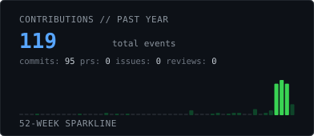
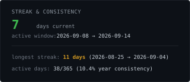
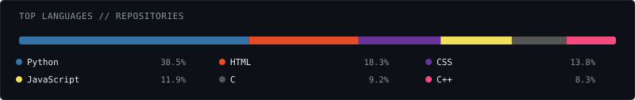
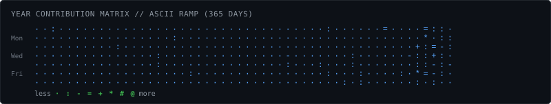

<h1 align="left">
  <code>ali osman seyis</code>
</h1>

<blockquote>
  <b>Computer Engineering Student @ Gazi University</b> 
  Specializing in Artificial Intelligence, Vision-Language Models (VLM/LLM), Edge Computing &amp; Scalable Web Architecture.
</blockquote>

 

<picture>
  
</picture>

Hi there, I'm **Ali Osman Seyis** — a 4th-year Computer Engineering student passionate about crafting high-performance, intelligent software systems. My work spans deep learning research (VLM &amp; LLM quantization), real-time computer vision on embedded hardware (NVIDIA Jetson / Raspberry Pi), and full-stack web platforms.

 

<picture>
  
</picture>

- **Vision-Language &amp; Generative AI:** Quantized multimodal pipelines (LLaVA), prompt engineering, retrieval-augmented systems.
- **Edge Computing &amp; Embedded Systems:** Real-time deep learning pipelines and hardware acceleration on <samp>NVIDIA Jetson Xavier / Nano</samp> and <samp>Raspberry Pi</samp>.
- **Computer Vision:** Real-time object detection, tracking, feature extraction, and edge inference using <samp>OpenCV</samp> and <samp>PyTorch</samp>.
- **Web &amp; Distributed Systems:** Modern web architectures with responsive interfaces and robust backend APIs (<samp>Python / Flask</samp>, <samp>C# / .NET</samp>, <samp>Node.js / React</samp>).

 

<picture>
  
</picture>

- **LLaVA 4-bit Quantized Multimodal Pipeline** — Efficient fine-tuning and inference workflows for large vision-language models on memory-constrained environments.
- **Real-Time Edge Vision Pipeline** — Optimized low-latency object detection and tracking deployed directly onto NVIDIA Jetson embedded platforms.
- **Smart Object Recognition Systems** — Deep learning-based multi-class classification and detection leveraging OpenCV and PyTorch.
- **Interactive Farming Simulator** — Mobile game built with <samp>Flutter</samp> and <samp>Flame Engine</samp> focusing on state management and game loop optimization.
- **Full-Stack Web Platforms** — Dynamic web applications featuring responsive UI, RESTful API architecture, and database integrations.

 

<picture>
  
</picture>

  <strong>Languages:</strong> 
  <samp>Python</samp> · <samp>C#</samp> · <samp>C++</samp> · <samp>JavaScript</samp> · <samp>TypeScript</samp> · <samp>Dart</samp> · <samp>SQL</samp> · <samp>Shell</samp>

  <strong>AI &amp; Computer Vision:</strong> 
  <samp>PyTorch</samp> · <samp>OpenCV</samp> · <samp>Hugging Face</samp> · <samp>LLaVA / Transformers</samp> · <samp>NumPy</samp> · <samp>scikit-learn</samp>

  <strong>Frameworks &amp; Tools:</strong> 
  <samp>.NET</samp> · <samp>Flask</samp> · <samp>Node.js</samp> · <samp>React</samp> · <samp>Flutter</samp> · <samp>Docker</samp> · <samp>Git</samp> · <samp>Linux</samp>

  <strong>Hardware &amp; Edge:</strong> 
  <samp>NVIDIA Jetson Xavier / Nano</samp> · <samp>Raspberry Pi</samp> · <samp>CUDA</samp> · <samp>TensorRT</samp>

 

<picture>
  
</picture>

  <table border="0" cellspacing="0" cellpadding="0">
    <tr valign="top">
      <td width="392">
        
      </td>
      <td width="16"></td>
      <td width="392">
        
      </td>
    </tr>
    <tr height="12"></tr>
    <tr valign="top">
      <td colspan="3" width="800">
        
      </td>
    </tr>
    <tr height="12"></tr>
    <tr valign="top">
      <td colspan="3" width="800">
        
      </td>
    </tr>
  </table>

 

<picture>
  
</picture>

  Let's connect and build intelligent systems together:

- ✉️ Email: <samp><a href="mailto:connect.aosm@gmail.com">connect.aosm@gmail.com</a></samp>
- 🐙 GitHub: <samp><a href="https://github.com/Aosm26">github.com/Aosm26</a></samp>
- 🤝 Open for: <samp>AI/ML Collaborations</samp> · <samp>Edge AI Engineering</samp> · <samp>Open Source Projects</samp>

 

---

  Generated automatically by repository actions · Zero third-party tracker or widget dependencies

